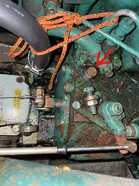

# Leiðbeiningar og góð ráð

**Efni**

1. [Dekkið og segl](README.md#Dekkið og segl)
2. [Vélin](README.md#Vélin)
3. [Sigling](README.md#Sigling)
4. [Siglingatæki](README.md#Siglingatæki)
5. [Inni](README.md#Inni)

# Gátlistar
- [Brottför](gatlisti-ut.md)
- [Koma](gatlisti-inn.md)

# Dekkið og segl
## Landfestar
Landfestar eru 6. Tvær við skut, tvær við stefni og 2 leiðarar sem fara frá stefni og aftur fyrir skut. Festa skal allar 6. Hlutverk leiðarann er að koma í veg fyrir að skútan færist aftur í stæðinu og reki skutinn í flotbryggjuna.

## Hífing segla
Þegar stórseglið híft upp í topp þá er hætta á að það krækist undir runnerana og er best að sigla stíft upp í vind þannig að vindurinn haldi seglinu beint aftur. Ef það er lítill vindur þá er gott að keyra vel á vélinni til að fá hreifingu á vindinn.

Þegar rúlluseglið er tekið út er gott að halda við línuna til að hún fari þétt inn á rúlluna. Annars getur hún verið flækt þegar rúlla á seglinu inn.

# Vélin

## Kaldræsing
Stjórnborðsmegin á vélinni er lítill hnappur sem hægt er að ýta inn og þá fer vélin auðveldar í gang þegar hún er köld

## Áfylling
Véling gengur fyrir dísel olíu og er leyfilegt að nota litaða olíu. Það er viðskiptakort í efstuskúffunni við kortaborðið til að kaupa olíu. Hægt er að sigla að olíudælu innst í Reykavíkurhöfn til móts við við Norðurbugt eða á endanum á innstu . Fyllt er á í stút sem út við síðuna á bakborða til móts við mastrið. Stúturin er með RAUÐU loki. Stúturinn á stjórnborðssíðu er fyrir vatn. Það er vara olía í brúsa í lestinni. Ef hún er notuð þá er mikilvægt að fylla aftur á brúsann.

### Keyrsla á vél
Hæfilegur snúninghraði er innan við 2000 og hámark er 2500. Það verður að vera svissað á startarann þegar keyrt er til að kælingin virki.

# Sigling

## Siglt úr stæði
Ef siglt er út úr kvínni við Hörpu með sterkan hliðarvind úr vestri þá er hætta á að vindurinn ýti stefninu á stjórnborða og beini skútunni á hafnarkanntinn áður en skuturinn kemur út úr stæðinu og hægt er að beita stýrinu á móti. Við þessar aðstæður er best að hafa mann framá sem heldur í landfestina bakborðsmegin að framan og beinir þannig skútunni upp í vindinn.

## Siglt í stæði
Öruggast er að snúa skútunni utan við flotbryggjuna og bakka rólega alla leið inn í stæðið. Sérstaklega ef það er hliðarvindur úr vestri sem getur hrakið hana upp í hafnargarðinn. Ef það er mikill vindur þá er öruggara að setja mann í land t.d. á enda annarrar flotbryggjunnar svo að hann geti tekið á móti skútunni í stæðinu.

# Siglingatæki
## Plotter

## Vindex

## Talstöð

# Inni
## Klósett
Klóakið fer í tank og því er í lagi að nota klósettið í höfn en það þarf að losa tankinn reglulega. Tankinn má losa þegar skútan er utan við eyjar en alls ekki inni í höfn. Það er fótstig í skápnum við hliðina á klósettinu og er pumpað með því úr tanknum.

# Viðhald á þessari handbók
Þessi handbók er uppsett sem GitHub repository sem Georg heldur utan um og notast við Pages. Efni er skrifað með MarkDown https://www.markdownguide.org/cheat-sheet/. Þeir sem vilja taka þátt í að viðhalda handbókinni þurfa að hafa GitHub Account og senda kennið til Georgs sem bætir því við sem Collaborator.
