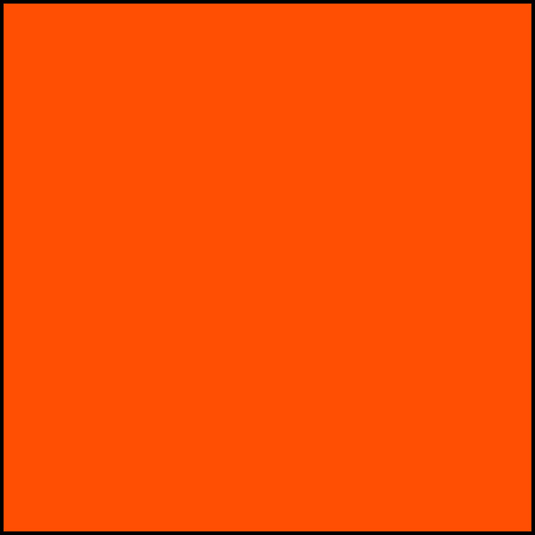

[Til baka á aðalsíðu](README.md)

# Rásmerki
|===

|  Tími í start |  Fánar uppi | Hljóðmerki  | 
|---|---|---|
|  5 mín |   | stutt flaut |
|  4 mín |    | stutt flaut  |
|  1 mín |   | langt flaut  |
|  0 mín |   | stutt flaut |

|===
# Recall
|  Gerð |  Fánar uppi | Hljóðmerki  | Skýring|
|---|---|---|---|
|  General |   | stutt flaut |Allir bátar til baka. Endurræsing|
|  Individual |   | stutt flaut  |Stakir bátar taki refsihring|

Í individual recall eiga stakir bátar að koma til baka og taka hring yfir ráslínu. Gert er ráð fyrir að bátarnir viti sjálfir hvort þeir hafi þjófstartað. Flaggið er tekið niður þegar síðasti báturinn sem þjófstartaði er búinn að taka hring eða eftir 4 mínútur.

# Keppnisreglur
* Bátur undan vindi á réttinn.
* Þegar tveir bátar koma að bauju skal ytri báturinn að gefa þeim innri nægt rými.
