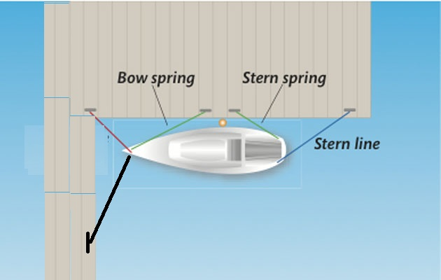

[Til baka á aðalsíðu](README.md)
## Sigling
### Reykjavikurhöfn við Hörpu
#### Siglt úr stæði
Ef siglt er út úr kvínni við Hörpu með sterkan hliðarvind úr vestri þá er hætta á að vindurinn ýti stefninu á stjórnborða og beini skútunni á hafnarkanntinn áður en skuturinn kemur út úr stæðinu og hægt er að beita stýrinu á móti. Við þessar aðstæður er best að hafa mann framá sem heldur í landfestina bakborðsmegin að framan og beinir þannig skútunni upp í vindinn.

#### Siglt í stæði
Öruggast er að snúa skútunni utan við flotbryggjuna og bakka rólega alla leið inn í stæðið. Sérstaklega ef það er hliðarvindur úr vestri sem getur hrakið hana upp í hafnargarðinn. Ef það er mikill vindur þá er öruggara að setja mann í land t.d. á enda annarrar flotbryggjunnar svo að hann geti tekið á móti skútunni í stæðinu.

## Landfestar
### Hafnarfjörður
Í stæðinu okkar við félagsbryggjuna í Hafnarfirði er bryggjukanntur "fingur" sunnanvert en ekki að norðan. Fingurinn er styttri en skútan og því ekki hægt að setja góða landfesti við skutinn (bláa lína á myndinni hér fyrir neðan) sem kæmi í veg fyrir að ytri endi skútunnar sveiflist út (stefni eða skutur, eftir því hvernig skútan snýr) og að innri endinn rekist í fingurinn. Til að vega á móti þessu þarf að hafa trausta festi frá innri endanum til norðurs, svört lína á myndinni hér fyrir neðan og festa hann eins langt frá og hægt er. Springerarnir, grænu línurnar, koma í veg fyrir að skútan renni inn í bryggjuna og þarf að gæta sérstaklega að því að springerinn frá stefni og aftur með síðunni (bow spring) nái vel aftur og sé vel festur og traustur.

## [Keppni](keppni.md)
