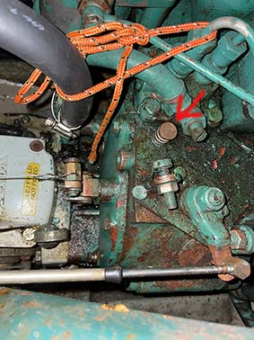

[Til baka á aðalsíðu](README.md)
## Vélin
Vél: Volvo Penta MD 11C serial no. 44806

Drif, S drif:  serial no. PZ NR 1120777B 

- 23 hestöfl (hp), jafngildir 17 kW.
- 2 stimplar, 4 gengis
- Gefin upp fyrir max 2500 rpm

Kæling er með sjóinntak inn á varmaskipti fyrir lokað kælikerfi sem er með fersku frostvörðu kælivatni. Dælan á kælingunni er mekanisk en dælan á sjóinntakinu er rafdrifin og því þarf alltaf að vera svissað á þegar vélin er í gangi.

### Kaldræsing
Stjórnborðsmegin á vélinni er lítill hnappur sem hægt er að ýta inn og þá fer vélin auðveldar í gang þegar hún er köld

### Áfylling
Véling gengur fyrir dísel olíu og er leyfilegt að nota litaða olíu. Það er viðskiptakort í efstu skúffunni við kortaborðið til að kaupa olíu. . Fyllt er á í stút sem út við síðuna á bakborða til móts við mastrið. Stúturin er með RAUÐU loki. Annar stútur á stjórnborðssíðu er fyrir vatn. Það er vara olía í brúsa í lestinni. Ef hún er notuð þá er mikilvægt að fylla aftur á brúsann.

- **Hafnarfjörður**: Olíudæla er innst í smábátahöfninni. ATH, það er mjög grunnt við bryggjuna og ekki nægilegt dýpi á fjöru fyrir Stellu (ristir 2 metra). Miða ætti við að vera 2 tíma frá fjöru og fara á endann.
- **Reykjavík**: Hægt er að sigla að olíudælu innst í höfninni til móts við við Norðurbugt.

### Keyrsla á vél
Hæfilegur snúninghraði er innan við 2000 og hámark er 2500. Það verður að vera svissað á startarann þegar keyrt er til að kælingin virki.
Vatnsloki opnar við 60°C. Æskilegur keyrsluhiti innan við 88°C, ekki fara yfir 90°C.

### Volvo Penta umboð

tengiliður hjá Velti:  

Hilmar Skúli HjartarsonAðstoðar verk- og tæknistjóri  
Assitance Workshop forman  
hilmarh@veltir.is  
Sími +354 510 9100  
Mobile +354 8978579  
www.veltir.is  

### Volvo_Do_It_Yourself_handbook_MD5_MD7_MD11_MD17.pdf
[pdf](skrar/Volvo_Do_It_Yourself_handbook_MD5_MD7_MD11_MD17.pdf)
